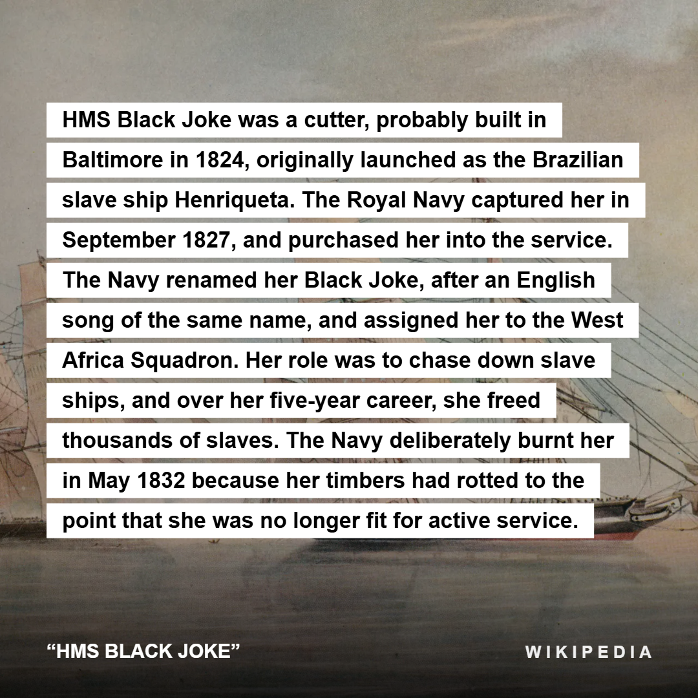
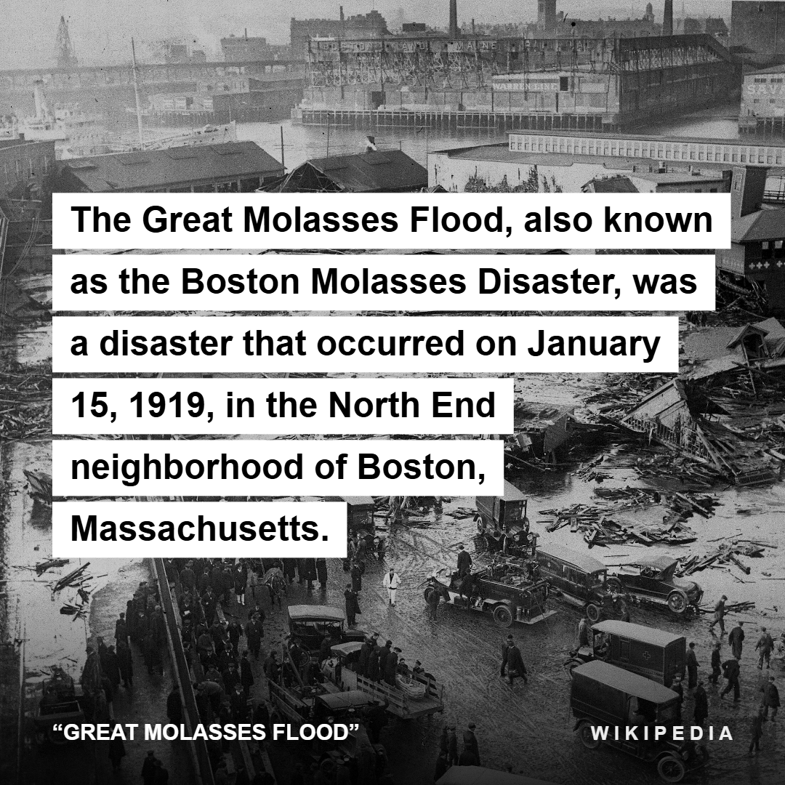
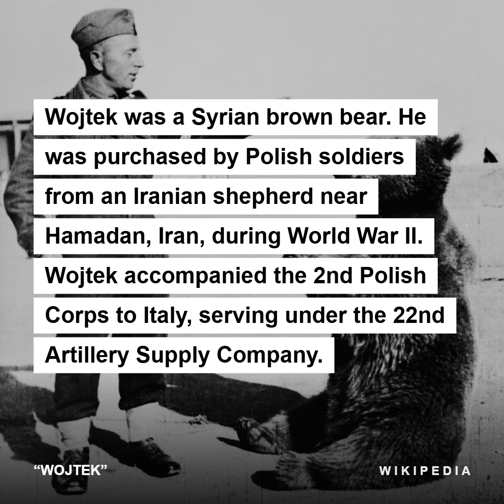

# Wiki Cards

**Genius lyric cards, but for Wikipedia.**

Highlight a passage on any Wikipedia article → right-click → **Make Wiki card** →
a share-ready card is on your clipboard. Paste it into any chat.

  
  
  

## What it does

- **The Genius aesthetic** — your selection rendered as white highlight chips
  over the article's own imagery, with a `"TITLE"` / `W I K I P E D I A`
  attribution bar.
- **Built for density** — lyric cards carry one line; Wikipedia selections
  carry paragraphs. Font auto-scales 56px → 25px and the canvas grows
  1080×1080 → 1080×2000 before anything gets truncated.
- **Headings become labels** — select across a section title and it renders as
  a small uppercase label chip instead of colliding with the paragraph text.
- **Reads like prose, not like Wikipedia** — citation markers (`[17]`), IPA
  pronunciations, respellings, and "listen" widgets are stripped (both the
  legacy-parser and Parsoid markup variants), including the parentheses they
  leave behind. `"Chicago (/ʃɪˈkɑːɡoʊ/ shih-KAH-goh) is..."` → `"Chicago is..."`.
- **Smart image pool** — images inside your selection come first, the
  article's main image fills in, low-res thumbs are upscaled to 1000px
  variants, duplicates deduped by Commons filename. First image becomes the
  background, the rest a thumbnail strip. No images? Clean dark card.
- **Zero dependencies** — four hand-written files, no build step, pure canvas.
  Everything runs locally; the only network traffic is fetching Wikipedia's
  own images. Data collection: none, and the manifest says so.

## Install

**Signed build (recommended):** grab the `.xpi` from the
[latest release](https://github.com/coldcraft/wiki-cards/releases/latest),
then `about:addons` → gear icon → **Install Add-on From File…** (or click the
`.xpi` link in Firefox and approve the prompt). Note: releases don't
auto-update — check back for new versions.

**From source (for hacking):** `about:debugging#/runtime/this-firefox` →
**Load Temporary Add-on…** → pick `manifest.json`. Unloads on restart. For
your own permanent build, zip the four extension files and submit to
[addons.mozilla.org](https://addons.mozilla.org/developers/) as
self-distributed/unlisted — automated validation signs an installable `.xpi`
in minutes (change the `gecko.id` in the manifest first, since each add-on ID
can only be signed by one AMO account).

## How it works

| File | Role |
| --- | --- |
| `content.js` | Walks the selection DOM into heading/body segments, strips wiki metadata, collects image URLs + the `og:image` |
| `card.js` | Pure canvas renderer — layout, chip wrapping, adaptive sizing. No extension APIs |
| `background.js` | Context menu → fetch images → render → `browser.clipboard.setImageData` |
| `test/harness.html` | Feeds the same renderer live Wikipedia REST API data for visual iteration — serve the repo folder over HTTP and open `/test/harness.html` |

MIT.
